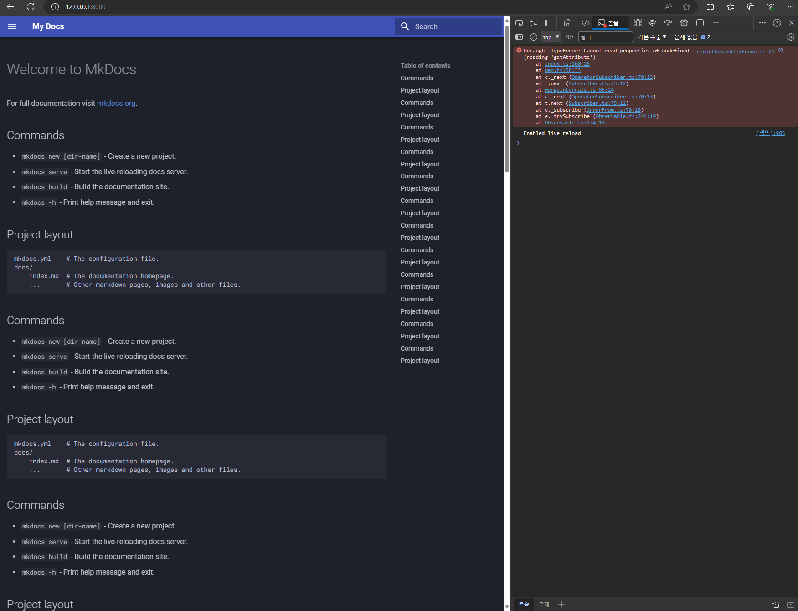

# Bug reproducing repository for [mkdocs-material](https://squidfunk.github.io/mkdocs-material)

This repository is used to introduce users to reproduce `mkdocs-material` bug [discussed here](https://github.com/squidfunk/mkdocs-material/discussions/6644#discussioncomment-8121881).

## Steps to reproduce in local

1. Clone this repository.
2. Make a virtual environment (Python 3.11) for this repository.
3. Run `pip install --upgrade --force-reinstall mkdocs-material` to install `mkdocs-material`.
4. Checkout to [commit ff4d4cf](https://github.com/McDic/mkdocs-material-palette-bug-report-2024-01/tree/ff4d4cf8d253bab0cc74af9c0abbf9907c359871).
5. Run `mkdocs serve` in your terminal to turn on local server.
6. Access `127.0.0.1:8000` from your browser.
7. Press button on the website to make palette to the dark mode.
8. Checkout to [commit a0d3b0b](https://github.com/McDic/mkdocs-material-palette-bug-report-2024-01/tree/a0d3b0b6978b0222de4e5ca1bd8644520535cf92) and refresh your build (`mkdocs serve` will refresh automatically).
9. Enjoy the bug. Javascript stuffs like searching, side navigations wouldn't work.

## Steps to reproduce `.zip` files

Since `mkdocs-material` encourages people to [use `.zip` files made by `info` plugin](https://squidfunk.github.io/mkdocs-material/contributing/reporting-a-bug/#reproduction) instead of making a repository, I am going to make 2 `.zip` files.

1. Run `echo 2_palettes | mkdocs build -f mkdocs_2_palettes.yml -d`
2. Run `echo 3_palettes | mkdocs build -f mkdocs_3_palettes.yml`

## Proposal to resolve this

I suggest to insert a validation JS code for invalid values in cache.
